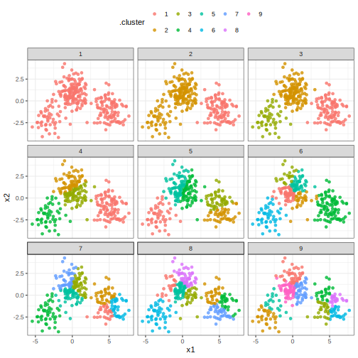
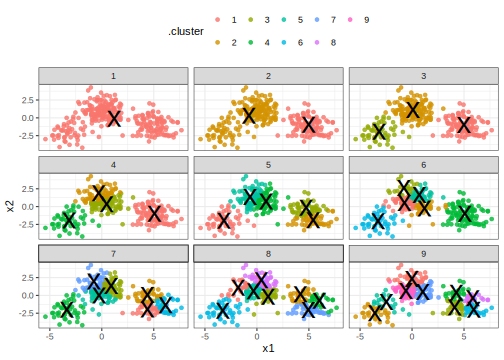
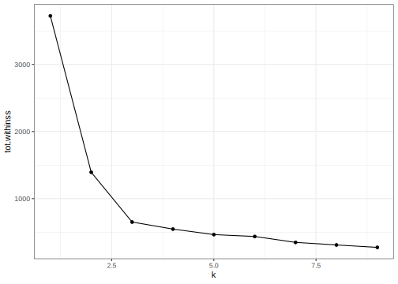

## Introduction

This article only requires the tidymodels package.

K-means clustering serves as a useful example of applying tidy data principles to statistical analysis, and especially the distinction between the three tidying functions: 

- `tidy()`
- `augment()` 
- `glance()`

Let's start by generating some random two-dimensional data with three clusters. Data in each cluster will come from a multivariate gaussian distribution, with different means for each cluster:


::: {.cell layout-align="center"}

```{.r .cell-code}
library(tidymodels)

set.seed(27)

centers <- tibble(
  cluster = factor(1:3), 
  num_points = c(100, 150, 50),  # number points in each cluster
  x1 = c(5, 0, -3),              # x1 coordinate of cluster center
  x2 = c(-1, 1, -2)              # x2 coordinate of cluster center
)

labelled_points <- 
  centers %>%
  mutate(
    x1 = map2(num_points, x1, rnorm),
    x2 = map2(num_points, x2, rnorm)
  ) %>% 
  select(-num_points) %>% 
  unnest(cols = c(x1, x2))

ggplot(labelled_points, aes(x1, x2, color = cluster)) +
  geom_point(alpha = 0.3)
```

::: {.cell-output-display}
{fig-align='center' width=672}
:::
:::


This is an ideal case for k-means clustering. 

## How does K-means work?

Rather than using equations, this short animation using the [artwork](https://github.com/allisonhorst/stats-illustrations) of Allison Horst explains the clustering process:


::: {.cell layout-align="center"}
{fig-align='center'}
:::


## Clustering in R

We'll use the built-in `kmeans()` function, which accepts a data frame with all numeric columns as it's primary argument.


::: {.cell layout-align="center"}

```{.r .cell-code}
points <- 
  labelled_points %>% 
  select(-cluster)

kclust <- kmeans(points, centers = 3)
kclust
#> K-means clustering with 3 clusters of sizes 148, 51, 101
#> 
#> Cluster means:
#>            x1        x2
#> 1  0.08853475  1.045461
#> 2 -3.14292460 -2.000043
#> 3  5.00401249 -1.045811
#> 
#> Clustering vector:
#>   [1] 3 3 3 3 3 3 3 3 3 3 3 3 3 3 3 3 3 3 3 3 3 3 3 3 3 3 3 3 3 3 3 3 3 3 3 3 3
#>  [38] 3 3 3 3 3 3 3 3 3 3 3 3 3 3 3 3 3 3 3 3 3 3 3 3 3 3 3 3 3 3 3 3 3 3 3 3 3
#>  [75] 3 3 3 3 3 3 3 3 3 3 3 3 3 3 3 3 3 3 3 3 3 3 3 3 3 3 1 1 1 1 1 1 1 1 1 1 1
#> [112] 1 1 1 1 1 1 1 1 1 1 1 1 1 1 1 1 1 1 1 1 1 1 1 1 1 1 1 1 1 1 1 1 1 1 1 1 1
#> [149] 1 1 1 1 1 1 1 1 1 1 1 1 1 1 1 1 1 1 1 1 1 1 1 1 1 1 1 1 1 1 1 1 1 1 1 1 1
#> [186] 1 1 1 1 1 1 1 1 1 1 1 1 1 3 1 1 1 1 1 1 1 1 1 1 1 1 1 1 1 1 1 1 1 1 1 1 1
#> [223] 1 1 1 1 1 1 1 1 1 1 1 1 1 1 1 1 1 1 1 1 1 2 1 1 1 1 1 1 2 2 2 2 2 2 2 2 2
#> [260] 2 2 2 2 2 2 2 2 2 2 2 2 2 2 2 2 2 2 2 2 2 2 2 2 2 2 2 2 2 2 2 2 2 2 2 2 2
#> [297] 2 2 2 2
#> 
#> Within cluster sum of squares by cluster:
#> [1] 298.9415 108.8112 243.2092
#>  (between_SS / total_SS =  82.5 %)
#> 
#> Available components:
#> 
#> [1] "cluster"      "centers"      "totss"        "withinss"     "tot.withinss"
#> [6] "betweenss"    "size"         "iter"         "ifault"
summary(kclust)
#>              Length Class  Mode   
#> cluster      300    -none- numeric
#> centers        6    -none- numeric
#> totss          1    -none- numeric
#> withinss       3    -none- numeric
#> tot.withinss   1    -none- numeric
#> betweenss      1    -none- numeric
#> size           3    -none- numeric
#> iter           1    -none- numeric
#> ifault         1    -none- numeric
```
:::


The output is a list of vectors, where each component has a different length. There's one of length 300, the same as our original data set. There are two elements of length 3 (`withinss` and `tot.withinss`) and `centers` is a matrix with 3 rows. And then there are the elements of length 1: `totss`, `tot.withinss`, `betweenss`, and `iter`. (The value `ifault` indicates possible algorithm problems.)

These differing lengths have important meaning when we want to tidy our data set; they signify that each type of component communicates a *different kind* of information.

- `cluster` (300 values) contains information about each *point*
- `centers`, `withinss`, and `size` (3 values) contain information about each *cluster*
- `totss`, `tot.withinss`, `betweenss`, and `iter` (1 value) contain information about the *full clustering*

Which of these do we want to extract? There is no right answer; each of them may be interesting to an analyst. Because they communicate entirely different information (not to mention there's no straightforward way to combine them), they are extracted by separate functions. `augment` adds the point classifications to the original data set:


::: {.cell layout-align="center"}

```{.r .cell-code}
augment(kclust, points)
#> # A tibble: 300 × 3
#>       x1     x2 .cluster
#>    <dbl>  <dbl> <fct>   
#>  1  6.91 -2.74  3       
#>  2  6.14 -2.45  3       
#>  3  4.24 -0.946 3       
#>  4  3.54  0.287 3       
#>  5  3.91  0.408 3       
#>  6  5.30 -1.58  3       
#>  7  5.01 -1.77  3       
#>  8  6.16 -1.68  3       
#>  9  7.13 -2.17  3       
#> 10  5.24 -2.42  3       
#> # ℹ 290 more rows
```
:::


The `tidy()` function summarizes on a per-cluster level:


::: {.cell layout-align="center"}

```{.r .cell-code}
tidy(kclust)
#> # A tibble: 3 × 5
#>        x1    x2  size withinss cluster
#>     <dbl> <dbl> <int>    <dbl> <fct>  
#> 1  0.0885  1.05   148     299. 1      
#> 2 -3.14   -2.00    51     109. 2      
#> 3  5.00   -1.05   101     243. 3
```
:::


And as it always does, the `glance()` function extracts a single-row summary:


::: {.cell layout-align="center"}

```{.r .cell-code}
glance(kclust)
#> # A tibble: 1 × 4
#>   totss tot.withinss betweenss  iter
#>   <dbl>        <dbl>     <dbl> <int>
#> 1 3724.         651.     3073.     2
```
:::


## Exploratory clustering

While these summaries are useful, they would not have been too difficult to extract out from the data set yourself. The real power comes from combining these analyses with other tools like [dplyr](https://dplyr.tidyverse.org/).

Let's say we want to explore the effect of different choices of `k`, from 1 to 9, on this clustering. First cluster the data 9 times, each using a different value of `k`, then create columns containing the tidied, glanced and augmented data:


::: {.cell layout-align="center"}

```{.r .cell-code}
kclusts <- 
  tibble(k = 1:9) %>%
  mutate(
    kclust = map(k, ~kmeans(points, .x)),
    tidied = map(kclust, tidy),
    glanced = map(kclust, glance),
    augmented = map(kclust, augment, points)
  )

kclusts
#> # A tibble: 9 × 5
#>       k kclust   tidied           glanced          augmented         
#>   <int> <list>   <list>           <list>           <list>            
#> 1     1 <kmeans> <tibble [1 × 5]> <tibble [1 × 4]> <tibble [300 × 3]>
#> 2     2 <kmeans> <tibble [2 × 5]> <tibble [1 × 4]> <tibble [300 × 3]>
#> 3     3 <kmeans> <tibble [3 × 5]> <tibble [1 × 4]> <tibble [300 × 3]>
#> 4     4 <kmeans> <tibble [4 × 5]> <tibble [1 × 4]> <tibble [300 × 3]>
#> 5     5 <kmeans> <tibble [5 × 5]> <tibble [1 × 4]> <tibble [300 × 3]>
#> 6     6 <kmeans> <tibble [6 × 5]> <tibble [1 × 4]> <tibble [300 × 3]>
#> 7     7 <kmeans> <tibble [7 × 5]> <tibble [1 × 4]> <tibble [300 × 3]>
#> 8     8 <kmeans> <tibble [8 × 5]> <tibble [1 × 4]> <tibble [300 × 3]>
#> 9     9 <kmeans> <tibble [9 × 5]> <tibble [1 × 4]> <tibble [300 × 3]>
```
:::


We can turn these into three separate data sets each representing a different type of data: using `tidy()`, using `augment()`, and using `glance()`. Each of these goes into a separate data set as they represent different types of data.


::: {.cell layout-align="center"}

```{.r .cell-code}
clusters <- 
  kclusts %>%
  unnest(cols = c(tidied))

assignments <- 
  kclusts %>% 
  unnest(cols = c(augmented))

clusterings <- 
  kclusts %>%
  unnest(cols = c(glanced))
```
:::


Now we can plot the original points using the data from `augment()`, with each point colored according to the predicted cluster.


::: {.cell layout-align="center"}

```{.r .cell-code}
p1 <- 
  ggplot(assignments, aes(x = x1, y = x2)) +
  geom_point(aes(color = .cluster), alpha = 0.8) + 
  facet_wrap(~ k)
p1
```

::: {.cell-output-display}
{fig-align='center' width=672}
:::
:::


Already we get a good sense of the proper number of clusters (3), and how the k-means algorithm functions when `k` is too high or too low. We can then add the centers of the cluster using the data from `tidy()`:


::: {.cell layout-align="center"}

```{.r .cell-code}
p2 <- p1 + geom_point(data = clusters, size = 10, shape = "x")
p2
```

::: {.cell-output-display}
{fig-align='center' width=672}
:::
:::


The data from `glance()` fills a different but equally important purpose; it lets us view trends of some summary statistics across values of `k`. Of particular interest is the total within sum of squares, saved in the `tot.withinss` column.


::: {.cell layout-align="center"}

```{.r .cell-code}
ggplot(clusterings, aes(k, tot.withinss)) +
  geom_line() +
  geom_point()
```

::: {.cell-output-display}
{fig-align='center' width=672}
:::
:::


This represents the variance within the clusters. It decreases as `k` increases, but notice a bend (or "elbow") around `k = 3`. This bend indicates that additional clusters beyond the third have little value. (See [here](https://web.stanford.edu/~hastie/Papers/gap.pdf) for a more mathematically rigorous interpretation and implementation of this method). Thus, all three methods of tidying data provided by broom are useful for summarizing clustering output.

## Session information {#session-info}


::: {.cell layout-align="center"}

```
#> ─ Session info ─────────────────────────────────────────────────────
#>  setting  value
#>  version  R version 4.3.3 (2024-02-29)
#>  os       macOS Sonoma 14.4.1
#>  system   aarch64, darwin20
#>  ui       X11
#>  language (EN)
#>  collate  en_US.UTF-8
#>  ctype    en_US.UTF-8
#>  tz       America/Los_Angeles
#>  date     2024-03-25
#>  pandoc   2.17.1.1 @ /opt/homebrew/bin/ (via rmarkdown)
#> 
#> ─ Packages ─────────────────────────────────────────────────────────
#>  package    * version date (UTC) lib source
#>  broom      * 1.0.5   2023-06-09 [1] CRAN (R 4.3.0)
#>  dials      * 1.2.1   2024-02-22 [1] CRAN (R 4.3.1)
#>  dplyr      * 1.1.4   2023-11-17 [1] CRAN (R 4.3.1)
#>  ggplot2    * 3.5.0   2024-02-23 [1] CRAN (R 4.3.1)
#>  infer      * 1.0.6   2024-01-31 [1] CRAN (R 4.3.1)
#>  parsnip    * 1.2.1   2024-03-22 [1] CRAN (R 4.3.1)
#>  purrr      * 1.0.2   2023-08-10 [1] CRAN (R 4.3.0)
#>  recipes    * 1.0.10  2024-02-18 [1] CRAN (R 4.3.1)
#>  rlang        1.1.3   2024-01-10 [1] CRAN (R 4.3.1)
#>  rsample    * 1.2.1   2024-03-25 [1] CRAN (R 4.3.1)
#>  tibble     * 3.2.1   2023-03-20 [1] CRAN (R 4.3.0)
#>  tidymodels * 1.1.1   2023-08-24 [1] CRAN (R 4.3.0)
#>  tune       * 1.2.0   2024-03-20 [1] CRAN (R 4.3.1)
#>  workflows  * 1.1.4   2024-02-19 [1] CRAN (R 4.3.1)
#>  yardstick  * 1.3.1   2024-03-21 [1] CRAN (R 4.3.1)
#> 
#>  [1] /Users/emilhvitfeldt/Library/R/arm64/4.3/library
#>  [2] /Library/Frameworks/R.framework/Versions/4.3-arm64/Resources/library
#> 
#> ────────────────────────────────────────────────────────────────────
```
:::
